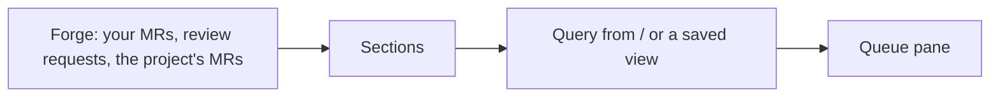
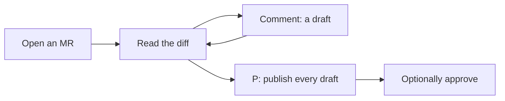

# Concepts

revu shows the MRs you care about, lets you read them, and turns your comments into one review.

## Words

### MR

A merge request on GitLab, or a pull request on GitHub.
revu calls both an MR.
`acme/widgets!42` is MR 42 of the GitLab project `acme/widgets`, and `acme/widgets#42` is PR 42 on GitHub.

### Forge

The site that hosts the code: GitLab or GitHub.
revu picks it from the host name: `github.com` is GitHub, any other host is GitLab.
`[hosts."<host>"] forge` says it for a host whose name does not tell.

### Queue

The list of MRs in the left pane.
Inside a checkout, it shows that project only.
`*` switches to every project you can see.

### Section

A group of MRs in the queue.

| Section | Holds |
|---|---|
| TO REVIEW | MRs where you are a reviewer and have not approved yet |
| MINE | MRs you wrote |
| WATCHING | MRs assigned to you, or with a label from `[queue] watch_labels` |
| OPEN | Every other open MR of the project |
| DRAFTS | Other people's draft MRs, folded |
| DONE | MRs you already approved or reviewed, folded |

MRs by one author that build on each other fold into one stack row.

### Draft

A comment only you can see.
Every comment you write in revu starts as a draft.
Drafts survive a restart.

### Review

All your drafts on one MR, made public at once with `P`.
You can approve in the same step.

| | GitLab | GitHub |
|---|---|---|
| A draft is | a draft note | a comment in your pending review |
| `P` sends | every draft note | the pending review |
| Approve with it | yes | yes |

## How the queue is built

revu asks the forge at start, then again every minute.
It paints from its cache first, so the screen is never empty.

## How a review goes

## Where revu keeps things

| What | Where |
|---|---|
| Tokens and AI keys | macOS keychain, service `revu` |
| Config | `~/.config/revu/config.toml` |
| Cache | `~/Library/Caches/revu/` |

## See also

- [Start here](start.md), to try it.
- [Config reference](reference/config.md), for every setting.
